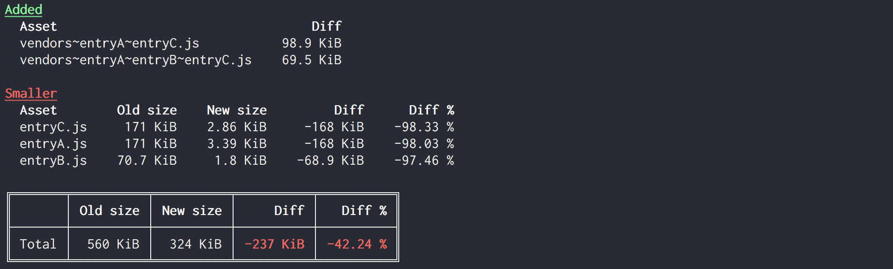
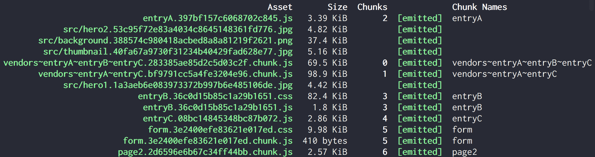
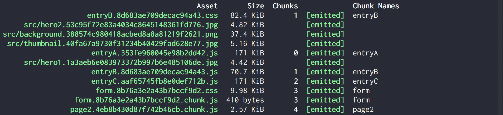

# webpack-stats-diff-plugin

Clear reporting of bundle sizes relative to the previous build or relative to an earlier build captured by a webpack stats file.

## Why is this useful?

Webpack prints absolute sizes of outputted files, but it's hard to see the overall impact of a code or configuration change. For example if you wanted to know the effect of changing webpack's `optimization.splitChunks.chunks` setting from its default `"async"` value to the recommended `"all"`,

Adding this plugin will highlight only the key changes:



Versus having to compare and contrast two standard webpack outputs:




## Installation & Usage

```
npm install webpack-stats-diff-plugin --save-dev
```

### Comparing to previous build output

Adding `new WebpackStatsDiffPlugin()` to the webpack plugins list will compare a new webpack build to the file sizes of the previous contents of the webpack output folder. Note, if `clean-webpack-plugin` is used it must be configured with `{beforeEmit: true}` for this plugin to be able to grab the previous build contents.

### Comparing to a webpack stats json file

This approach is helpful for comparing against an unchanging baseline build. To create a json stats file, add a script like `"build_stats": "webpack --profile --json > stats-master.json"` or use [webpack-stats-plugin](https://github.com/FormidableLabs/webpack-stats-plugin) with `opts.fields` containing `"assets"`. Then, add `new WebpackStatsDiffPlugin({oldStatsFile: 'path-to-stats-file.json'})` to the webpack plugins list to compare a new build against that baseline.

### Flexible opt-in webpack configuration

You likely don't want this relative size output all the time. The following configuration setup lets you pass environment variables to opt in to different plugin behaviors.

```javascript
const CleanWebpackPlugin = require('clean-webpack-plugin');
const WebpackStatsDiffPlugin = require('webpack-stats-diff-plugin');

module.exports = {
  output: {
    path: BUILD_FOLDER
  },
  plugins: [
    new CleanWebpackPlugin(BUILD_FOLDER, {beforeEmit: true}),
    // ... other plugins
    (process.env.COMPARE_PREVIOUS === 'true' || process.env.STATS_FILE) &&
      new WebpackStatsDiffPlugin({
        oldStatsFile: process.env.STATS_FILE
      })
  ].filter(Boolean);
};
```

With this setup, running

- `STATS_FILE=stats-master.json npm run build` compares the current build to the one used to create the stats file
- `COMPARE_PREVIOUS=true npm run build` compares the current build to the previous build folder contents

### Configuration

The WebpackStatsDiffPlugin constructor can take in the following optional fields:

- `oldStatsFile`: A string file path to a webpack stats file. If provided, the current build will be compared to the build that created the stats file rather than having it compared to the previous output folder contents.

- `extensions`: An array of strings, optionally with a leading period. If provided, only files matching a given extension will be displayed and used for calculating totals. For example, `extensions: ['.js']` will only show size changes for built javascript files.

- `threshold`: Minimum percent difference to qualify a size change as significant. This prevents flooding the output with files that have only trivially changed their compiled output. Defaults to `5`. Can set to 0 to see all changed file sizes.

### Supported environments

This plugin should work for webpack versions >= 2, and Node.js versions >= 6.14.3
